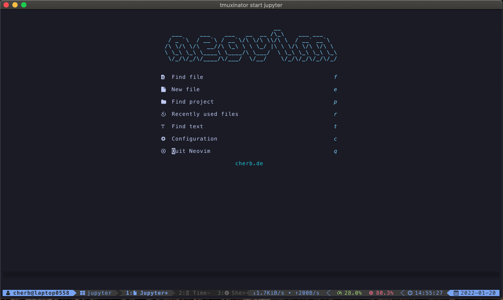

# chrishrbs dotfiles


Awesome Dotfiles for Mac, ZSH, TMUX, VIM and more..
It also includes some useful commandline tools.

## Installation
Install only the parts you need with just the command `./deploy.sh PART`
Valid parts can be shown with `./deploy.sh help`.

```shell
git clone git@github.com:chrishrb/dotfiles.git
cd dotfiles
./deploy.sh PART
```
